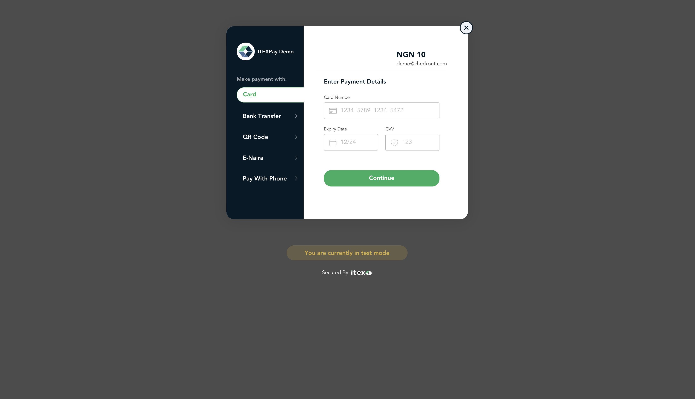

<p align="center">
    
</p>

# ItexPay React Library

[![NPM version][npm-image]][npm-url] [![Build][github-build]][github-build-url] ![npm-typescript] [![License][github-license]][github-license-url]


This SDK helps you accept payments seamlessly using ItexPay Inline Checkout.

## Demo



## Installation:
```bash
yarn add itexpay-react
```
or 

``` bash
npm install --save itexpay-react
```

## Usage :

There is currently only one way to use this library in your React project and that is using the `useItexPay` hook. This returns an object with two attributes: `handlePayment` (the function passed to the button on click) and `loaded` (which shows whether or not the script has been loaded completely).

Import `useItexPay` to your component:

```tsx
import * as React from 'react';
import { useItexPay, ItexPayProps } from 'itexpay-react'

const options: ItexPayProps = {
    api_key: '<your_api_key>',
    first_name: 'John',
    last_name: 'Doe',
    phone_number: '07011122233',
    email: 'johndoe@gmail.com',
    amount: 100,
    reference: '<your_transaction_reference>,
    currency: 'NGN'
}

const PaymentScreen = () => {

    const { handlePay, loaded } = useItexPay(options, {
        onCompleted: () => console.log('payment completed'), 
        onClose: () => console.log('onClose'), 
        onError: () => {}
    })

    if (!loaded) {
        return <p>Initializing payment...</p>
    }

    return (
        <button onClick = {handlePay}>Make payment</button>
    )
    
};

export default PaymentScreen
```

### Parameters

Read more about our parameters and how they can be used [here](https://itexpay.com/docs/checkout-inline#parameter-definition).

| Parameter           | Required? | Description                                                                                                                                                                                                                             |
| ------------------- | ----------------- | --------------------------------------------------------------------------------------------------------------------------------------------------------------------------------------------------------------------------------------- |
| api_key          | True              | Your public API key                                                                                                                                                                                                                     |
| reference              | True              | Your transaction reference. This MUST be unique for every transaction                                                                                                                                                                   |
| amount              | True              | The transaction amount (this is that amount the customer is going to be charged).                                                                                                                                                                                                          |
| currency            | True             | currency to charge in. Defaults to NGN                                                                                                                                                                                                  |
| redirecturl      | False             | URL to redirect the customer to upon completion of a transaction                                                                                                                 |
| first_name     | True              | Customer's first name                                                                                                                                            |
| last_name        | True             | Customer's last name                                                                                                                                                                                  |                                                                  |
| email            | True              | Customer's email address                    |
| phone_number         | True             | Customer's phone number |
| onComplete (function) | True             | This is the function that runs after payment is completed


# Support

If you need further support while using this library, don't hesitate to reach out to us. You can either create an issue on our Github repository or get in touch with our team through email at [developers@iisysgroup.com]. We are here to help!


## License

This project is licensed under the MIT License - see the [LICENSE.md](LICENSE.md) file for details

[npm-url]: https://www.npmjs.com/package/itexpay-react
[npm-image]: https://img.shields.io/npm/v/itexpay-react
[github-license]: https://img.shields.io/github/license/jeremiahjacinth13/itexpay-react
[github-license-url]: https://github.com/jeremiahjacinth13/itexpay-react/blob/master/LICENSE
[github-build]: https://github.com/jeremiahjacinth13/itexpay-react/actions/workflows/publish.yml/badge.svg
[github-build-url]: https://github.com/jeremiahjacinth13/itexpay-react/actions/workflows/publish.yml
[npm-typescript]: https://img.shields.io/npm/types/itexpay-react

